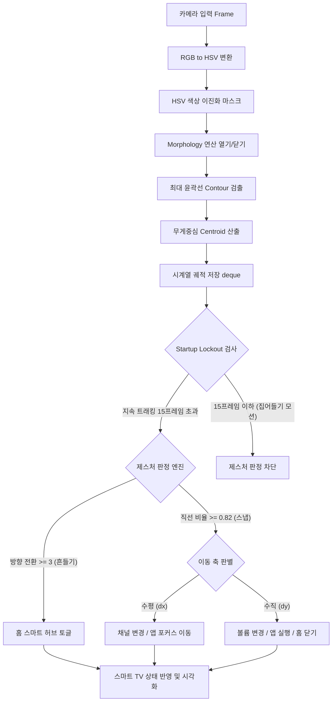

# [기술 제안서] 카메라 및 컬러 트래킹 기반 실시간 제스처 인식 TV 제어 시스템 (Rev. 1.1)

본 제안서는 일반 웹 카메라(Webcam)와 색상 추적(Color Tracking) 기술을 융합하여, 별도의 리모컨 없이 직관적인 스냅(Snap) 및 흔들기(Shake) 제스처로 스마트 TV를 원격 제어할 수 있는 저비용·고효율 스마트 홈 인터페이스 기술을 제안합니다.

---

## 1. 제안 배경 및 필요성

### 1.1 스마트 가전 시장의 성장과 인터페이스의 변화
스마트 홈 가전의 핵심 허브인 스마트 TV는 인터넷 브라우징, OTT 플랫폼(Netflix, YouTube 등), 스마트 가전 연동 등 다양한 기능을 수행하게 되었습니다. 그러나 이를 조작하는 전통적인 물리 리모컨은 다음과 같은 태생적 한계를 지닙니다.
* **사용성 한계**: 버튼이 많고 복잡하여 고령자나 어린이의 접근성이 낮습니다.
* **관리상 한계**: 물리 리모컨의 잦은 분실 및 배터리 교체 주기의 번거로움이 있습니다.
* **위생 및 비접촉 요구**: 공공장소나 주방 등 손에 이물질이 묻은 상태에서는 물리적 조작이 위생상 부적절합니다.

### 1.2 기존 제스처 인식 기술의 문제점
카메라 기반 제스처 인식은 비접촉 제어의 훌륭한 대안이지만, 기존 기술은 다음과 같은 문제를 안고 있습니다.
* **고비용 하드웨어**: 3D 깊이 센서(Depth Camera)나 ToF 카메라를 요구하여 센서 단가가 높습니다.
* **높은 연산 오버헤드**: 고성능 GPU 기반 딥러닝 모델(YOLO, 3D CNN 등)은 임베디드 TV 보드에서 실시간(Real-time) 구동이 어렵습니다.
* **오인식 취약성 및 프라이버시 침해**: 리모컨을 집어드는 일반적인 생활 모션(Pickup)이 오 트리거되거나, 흔들기 모션과 스냅 모션이 정확히 구분되지 않는 상용성 한계가 존재합니다. 또한 항상 켜져 있는 카메라 화면에 사용자의 얼굴과 실내 환경이 노출되어 개인정보 침해 우려가 있습니다.

**본 제안 기술은 저사양 웹캠과 경량 컴퓨터 비전 알고리즘을 사용하는 동시에, '프라이버시 보호 전용 화면(Privacy Mode)'과 '이중 필터 제스처 알고리즘'을 도입하여 사생활 침해와 오인식 문제를 해결한 실용적 솔루션입니다.**

---

## 2. 시스템 아키텍처 및 구현 기술

제안 시스템은 일반 RGB 카메라로부터 프레임을 입력받아 **[영상 전처리] -> [색상 범위 필터링] -> [윤곽선 분석 및 객체 추적] -> [시계열 궤적 분석] -> [제스처 판정 및 제어 명령 송신]**의 파이프라인으로 작동합니다.

### 2.1 HSV 색 공간 기반 객체 추적
* **HSV 변환**: 조명 변화에 취약한 RGB 대신 색상(Hue), 채도(Saturation), 명도(Value)를 독립적으로 제어할 수 있는 HSV 색 공간으로 영상을 변환하여 환경 강인성을 확보합니다.
* **실시간 칼리브레이션**: 컨트롤 패널에 HSV 조절 트랙바(Trackbar)를 내장하여, 사용 환경의 광원에 맞게 스티커(예: 형광 연두색) 검출 범위를 실시간으로 튜닝할 수 있습니다.
* **모폴로지 필터링**: `MORPH_OPEN`(소형 노이즈 제거) 및 `MORPH_CLOSE`(검출 영역 내부 홀 채우기) 연산을 결합하여 먼지나 배경 잡음에 의한 좌표 흔들림을 방지합니다.

### 2.2 궤적 시각화 및 모션 큐
* **실시간 궤적(Trajectory)**: 덱(deque) 메모리를 이용하여 스티커의 최근 20프레임 동안의 궤적 좌표를 저장하고, 시간 역순으로 페이딩 효과(두께 및 투명도 감쇄)를 준 선(Line)을 실시간으로 렌더링합니다. 이는 사용자에게 본인의 움직임이 시스템에 어떻게 반영되고 있는지 시각적 피드백(Visual Cue)을 줍니다.

---

## 3. 제스처 인식 및 오인식 방지 알고리즘

제안하는 제스처 판단 엔진은 **"흔들기(Shake)"**와 **"스냅(Snap)"** 모션을 독립된 물리 지표로 분류하고, 리모컨을 집어 드는 **"주워들기(Pickup)"** 모션을 하드웨어적 보정 없이 논리 필터로 걸러내도록 설계되었습니다.

### 3.1 흔들기(Shake) 제스처 판단 (홈 화면 토글)
단시간 내에 좌우로 왕복하는 흔들기 모션은 X축 속도(변위)의 부호가 빈번하게 바뀌는 특성을 지닙니다.
* **방향 전환 횟수(Direction Reversals)**: 궤적 시계열 리스트의 가로 변위값 $dx_i = x_i - x_{i-1}$ 중 미세 노이즈를 필터링한 의미 있는 가로 방향 이동 성분에서 부호($+ \leftrightarrow -$)가 바뀌는 빈도를 계산합니다.
* **판정 기준**: 20프레임 윈도우 내에서 방향 전환 횟수가 **3회 이상**이고, 전체 누적 이동 거리 $L_{total} = \sum \sqrt{dx^2 + dy^2}$ 가 **220px 이상**일 때 흔들기 제스처로 최종 판정합니다.

### 3.2 스냅(Snap) 제스처 및 직선성 검증 필터
스냅은 한 방향으로의 빠르고 직선적인 flick 모션입니다. 이를 흔들기나 비선형 노이즈와 구분하기 위해 **직선성 비율(Linearity Ratio)**을 검증합니다.
* **직선성 비율**: 6프레임 창(Window) 내의 최단 이동 변위 $D_{net}$와 실제 경로의 누적 길이 $L_{path}$의 비율을 구합니다.

$$Linearity = \frac{D_{net}}{L_{path}} = \frac{\sqrt{(x_0 - x_{W-1})^2 + (y_0 - y_{W-1})^2}}{\sum_{i=1}^{W-1} \sqrt{(x_i - x_{i-1})^2 + (y_i - y_{i-1})^2}}$$

* **판정 기준**: $Linearity \ge 0.82$ (직선 비중이 82% 이상)일 경우에만 스냅 판정을 진행하여 원형 회전이나 불규칙한 흔들림 중 스냅이 잘못 트리거되는 문제를 완벽히 방지합니다.
  1. **좌우 스냅 (수평 모션)**:
     - 조건: $|dx| > \text{Threshold}_x$ 이고, $|dx| > 1.8 \times |dy|$
     - **Right Snap / Left Snap**: 채널 변경 혹은 스마트 허브 앱 포커스 이동.
  2. **상하 스냅 (수직 모션)**:
     - 조건: $|dy| > \text{Threshold}_y$ 이고, $|dy| > 1.8 \times |dx|$
     - **Up Snap / Down Snap**: 볼륨 변경, 포커스된 앱 실행 혹은 스마트 허브 종료.

### 3.3 주워들기(Pickup) 동작 오인식 방지 (Startup Lockout)
리모컨을 바닥에서 집어 올릴 때 발생하는 급격한 상승 동작은 스냅(UP SNAP) 제스처 조건과 유사하여 기존 시스템에서 최다 오작동 원인이었습니다.
* **스타트업 락아웃(Startup Lockout)**: 타겟 스티커가 카메라 외부(LOST)에 있다가 내부(TRACKED)로 신규 등록되는 최초 시점부터 **첫 15프레임(약 0.5초) 동안 제스처 감지 루프를 잠금(Lockout)**합니다.
* 사용자 동작 분석상 주워 올리는 관성 운동은 15프레임 이내에 완료되므로, 정지 상태에 도달한 안전한 연속 트래킹 시점부터만 제스처를 인정하여 오작동을 근본적으로 소거합니다.

---

## 4. 스마트 TV 및 스마트 허브 시뮬레이션 데모

제안 기술을 실증하기 위해 OpenCV 윈도우 내에 통합 UI 데모를 고도화하여 탑재했습니다.
* **듀얼 패널 뷰**: 좌측은 제스처 입력 영역, 우측은 스마트 TV 화면을 띄워 조작 결과를 직관적으로 표시합니다.
* **프라이버시 보호 전용 화면 (Privacy Mode)**: 사용자의 실제 얼굴이나 배경이 감지 창에 그대로 렌더링되어 프라이버시가 노출되는 문제를 완벽히 방지하기 위해, 실시간 카메라 피드를 **순수 흰색 화면(White Canvas)**으로 덮어씁니다. 컬러 트래킹은 백그라운드 영상 프레임에서 격리되어 안전하게 동작하며, 흰색 화면에는 오직 스티커의 궤적(파란선), 바운딩 박스(초록 사각형), 중심좌표(빨간 점)만 렌더링되므로 프라이버시 우려가 전혀 없습니다.
* **스마트 허브(Smart Hub) 홈 화면**: 
  - 흔들기(SHAKE) 감지 시 메인 홈 화면으로 스위칭됩니다.
  - 가로 슬롯 형태로 **Netflix, YouTube, Disney+, Settings** 앱 카드가 렌더링됩니다.
  - 좌/우 스냅으로 카드를 브라우징하며 포커스된 카드는 녹색 네온 글로우 테두리로 강조 시각화됩니다.
* **가상 앱 독립 실행 화면**:
  - 홈 화면에서 위로 스냅(UP SNAP)하면 해당 앱이 스마트 TV 전체 화면으로 실행됩니다.
  - 각 앱은 넷플릭스 로고, 유튜브 재생 로고, 디즈니 애니메이션 원, 설정 톱니바퀴 그래픽 등 독창적인 BGR 픽셀 렌더링을 제공합니다.
  - 앱 구동 상태에서 다시 흔들거나(SHAKE) 임의의 방향으로 스냅을 입력하면 홈 화면으로 안전하게 리턴합니다.
* **채널별 동적 테마 애니메이션**: 
  - **KBS1 (뉴스 테마)**: 글로벌 지구형 엘립스 격자 및 하단 속보 티커 스크롤.
  - **KBS2 (음악 테마)**: 프레임과 연동되어 팽창/축소하는 네온 원과 엇갈리는 조명 빔 시뮬레이션.
  - **MBC (예능 테마)**: 화면에 사인파를 타며 올라오는 재미있는 거품 그래픽 및 팝업 자막.
  - **SBS (가요 테마)**: 슬라이딩되는 빗금 패턴 배경.
  - **YTN (24시간 뉴스)**: 로고 애니메이션 및 긴급 속보 자막 오버레이.
* **마우스 대체 모드(Fallback Simulation)**: 카메라가 없거나 칼리브레이션 전 단계일 경우, 마우스 드래그를 통해 스티커 궤적을 동일하게 생성하여 기능을 즉시 테스트할 수 있도록 지원합니다.

---

## 5. 기대 효과 및 향후 발전 방향

* **하드웨어 제약 극복**: 단일 보급형 카메라로 흔들기, 방향성 스냅, 가상 앱 선택 및 실행 등 고수준의 입력 매핑을 완벽히 수용하여 경쟁사 대비 극대화된 가성비를 가집니다.
* **사생활 보호 및 사용성 개선**: 프라이버시 모드 도입으로 사용자 사생활 유출 걱정 없이 안심하고 사용할 수 있으며, 초기 노이즈를 락아웃 필터로 정제하여 조작 불쾌감을 완전히 지웠습니다. 또한 제자리 쉐이크 모션을 도입하여 실제 스마트 TV 조작과 흡사한 직관적 스마트 홈 통합 인터페이스를 확립했습니다.
* **향후 발전 방향**: 딥러닝 기반 손가락 랜드마크 인식(MediaPipe Hands)을 백엔드로 도입하여 손가락 검지의 움직임에 직접 결합하고, 스마트 가전 통신 표준(Matter)과 스마트 가전 허브(UPnP)를 접목하여 최종 제품군으로 실용화할 계획입니다.
