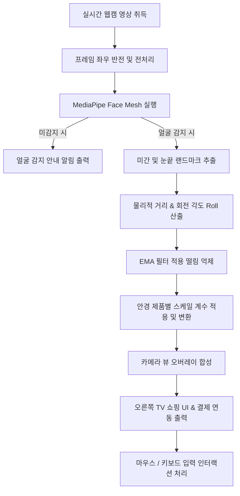

# 얼굴 가상 시착을 활용한 TV 기능 확장 기술 제안서
### (Virtual Try-on & Smart TV Commerce Integration Proposal)

---

## 1. 제안 배경 및 목적

최근 스마트 TV는 단순한 방송 수신 단말기를 넘어 웹 서핑, OTT 스트리밍, 홈트레이닝, 이커머스 등 다양한 양방향 서비스를 통합적으로 제공하는 **가정 내 미디어 허브**로 진화하고 있습니다. 

특히 홈쇼핑 및 TV 커머스 분야에서는 소비자가 화면을 통해 제품을 보기만 하고 실제 피팅감을 확인할 수 없어 반품률이 높고 구매 전환율이 정체되는 한계가 존재했습니다. 본 제안서는 이러한 제약을 해결하기 위해 스마트 TV에 내장된(혹은 USB로 연결된) 카메라와 인공지능 안면 분석 기술을 결합하여, 실시간으로 안경 등 패션 소품을 가상으로 시착하고 곧바로 결제까지 진행할 수 있는 **'가상 피팅 룸 기반 스마트 TV 커머스 확장 솔루션'**을 제안합니다.

---

## 2. 시스템 아키텍처 및 파이프라인

본 시스템은 실시간 카메라 스트림 분석부터 그래픽 합성 및 TV 커머스 주문 연동까지 단일 파이프라인으로 매끄럽게 흐르도록 설계되었습니다.

---

## 3. 핵심 기술 및 구현 알고리즘

### 3.1 랜드마크 기반 안경 기하학적 변환
안경을 착용자의 얼굴에 부자연스럽지 않고 정확하게 배치하기 위해, MediaPipe Face Mesh에서 추출한 478개 랜드마크 중 미간 정중앙(`Landmark 168`), 왼쪽 눈 바깥쪽 가장자리(`Landmark 130`), 오른쪽 눈 바깥쪽 가장자리(`Landmark 359`) 좌표를 기준점으로 유도합니다.

1. **안경 크기(Scale) 추정**: 
   사용자와 카메라 사이의 거리가 바뀌거나 머리 크기가 달라도 일정한 비율을 유지할 수 있도록, 두 눈 바깥쪽의 유클리드 거리($D_{eye}$)를 구하고 안경 제품 고유의 보정 스케일 계수($S_{calib}$)를 곱하여 최종 안경 폭($W_{target}$)을 유도합니다.
   $$D_{eye} = \sqrt{(x_{right} - x_{left})^2 + (y_{right} - y_{left})^2}$$
   $$W_{target} = D_{eye} \times S_{calib}$$

2. **안경 회전 각도(Roll Angle) 추정**:
   얼굴이 좌우로 기울어지는 각도를 추출하기 위해 삼각함수를 활용합니다.
   $$\theta = \arctan2(y_{right} - y_{left}, x_{right} - x_{left}) \times \frac{180}{\pi}$$

3. **안경 위치(Center Position) 정렬**:
   안경 코받침이 콧등 위에 자연스럽게 안착할 수 있도록 미간 랜드마크(`Landmark 168`)의 중심 좌표($C_{bridge}$)에 안경 높이 비율 대비 수직 오프셋($O_{y}$)을 가해 최종 합성 기준 좌표($Y_{center}$)를 도출합니다.
   $$Y_{center} = y_{bridge} + (H_{target} \times O_{y})$$

### 3.2 EMA (지수 이동 평균) 필터링
웹캠 영상의 미세한 노이즈나 랜드마크 지점의 미세 떨림(jittering) 현상은 가상 시착 시 안경이 파르르 떨려 시각적 완성도를 극도로 저해합니다. 이를 무력화하기 위해 위치, 스케일, 각도 물리량에 지수 이동 평균(EMA) 필터를 개별 도입합니다.
$$Y_t = \alpha \cdot X_t + (1 - \alpha) \cdot Y_{t-1}$$
- **위치 좌표 ($X, Y$)**: 사용자의 기민한 움직임 대응을 위해 $\alpha = 0.25$ 적용.
- **안경 폭 및 각도 ($Width, Angle$)**: 시각적 안정성과 부드러움을 위해 $\alpha = 0.15$ 적용.
이 최적화 필터를 통해 안경이 얼굴 움직임을 미끄러지듯 부드럽게 추종하며 따라갑니다.

### 3.3 알파 블렌딩 투명 오버레이
안경 이미지의 불투명 영역만 자연스럽게 웹캠 영상 프레임에 입히기 위해 알파 마스크를 0.0 ~ 1.0 범위로 정규화한 뒤 아래 블렌딩 수식을 적용하여 배경과 전경(안경)을 병합합니다.
$$Frame_{output} = (1 - \alpha) \cdot Frame_{background} + \alpha \cdot Image_{overlay}$$

---

## 4. 특화 차별화 전략 (Antigravity's Innovations)

### 4.1 에셋 투명 배경 자동 전처리 시스템 (`preprocess_assets.py`)
디자이너가 작업한 사진이나 AI 이미지 도구로 생성된 흰색 배경 안경 이미지를 그대로 사용할 수 있도록 자동화 전처리 스크립트를 내장했습니다. BGR 픽셀 값이 임계 조건($B, G, R > 245$)을 만족하는 흰색 영역(렌즈 내부 안쪽 공간 포함)의 알파 값을 완전히 0(투명)으로 처리하고, 경계 마스크에 미세 가우시안 블러를 줘서 지저분한 테두리 노이즈 없이 부드럽게 합성되도록 정교하게 처리합니다.

### 4.2 프라이버시 보호를 위한 '아바타 페이스 모드'
카메라에 자신의 실제 얼굴과 프라이버시 공간이 송출되는 것을 거부하는 소비자를 고려하여 `P` 키 입력 시 즉각 아바타 모드로 진입합니다. 실시간 카메라를 비활성화하고 검은 캔버스에 청록/녹색의 SF 풍 Face Mesh 와이어 프레임을 렌더링한 후, 가상 랜드마크 위에 투명 안경을 오버레이함으로써 안경의 형태학적 핏을 사생활 노출 없이 체감할 수 있습니다.

### 4.3 스마트 TV 커머스 UI 시뮬레이터 연동
가상 시착 카메라 뷰 우측에 스마트 TV용 홈쇼핑 쇼케이스 화면을 가로 병합 형태로 연동했습니다. 착용 안경의 브랜드, 재질, 설명, 실시간 가격이 동적으로 동기화되며, **[ORDER NOW]** 클릭 시 애니메이션 팝업 효과가 가동되어 실제 TV 서비스를 사용하듯이 사실감을 극대화했습니다.

---

## 5. 결론 및 향후 고도화 로드맵

본 프로젝트는 고성능 모바일 장비 없이도 경량 AI(MediaPipe)와 기하 수학적 연산 필터링 조합을 통해 극도의 시각 안정성을 보여주는 웹캠 가상 피팅 환경을 구성했습니다. 

향후 스마트 TV 플랫폼에서 다음 단계로의 기술 확장이 가능합니다:
1. **눈 깜빡임(Blink) 및 윙크 제스처 활용**: 리모컨이나 마우스 없이도 윙크 한 번으로 안경 디자인을 순차 교체하는 친화적 핸즈프리 인터랙션 구현.
2. **3D 원근 투영 변환(Perspective Warping)**: 2차원 회전을 넘어 얼굴의 Pitch, Yaw 3D 방향각을 획득하여 안경을 입체적으로 투영 왜곡함으로써 더욱 입체감 넘치는 피팅 지원.
3. **가상 메이크업 및 귀걸이 확장**: 동일 파이프라인 하에서 여성용 가상 립스틱 피팅 및 귀걸이 오버레이 등 멀티 카테고리 뷰티 쇼핑으로 확장 연동.
